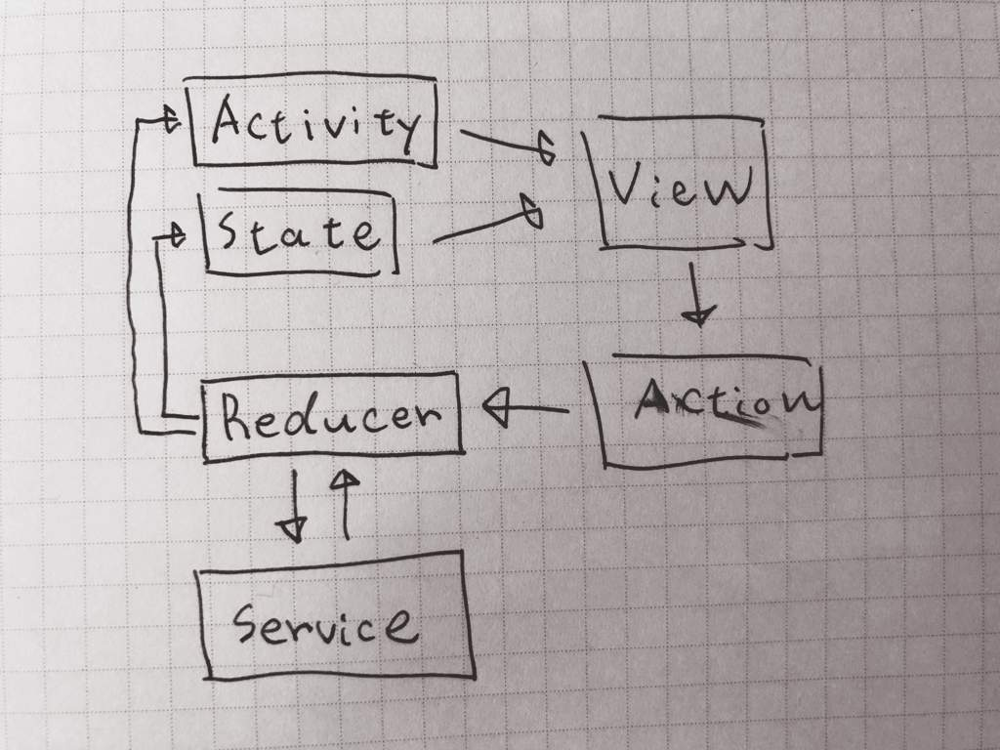

# Cycler

*This readme is working in progress*

## What is Cycler?

This is one of the ideas for ViewModel layer.
Mainly it's inspired by Flux architecture.


## CyclerType

ViewController should have one instance that is implementing `CyclerType`.
It likes ViewModel.

**Protocol**

```swift
public protocol CyclerType {
  associatedtype State
  associatedtype Activity
  var state: Storage<State> { get }
}
```

**Extension-Methods**

```swift
extension CyclerType {
  
  public var activity: Signal<Activity>
  
  public func commit(
      _ name: String = "",
      _ description: String = "",
      file: StaticString = #file,
      function: StaticString = #function,
      line: UInt = #line,
      _ mutate: @escaping (MutableStorage<State>) throws -> Void
      ) rethrows

  public func dispatch<T>(
    _ name: String = "",
    _ description: String = "",
    file: StaticString = #file,
    function: StaticString = #function,
    line: UInt = #line,
    _ action: (CyclerWeakContext<Self>) throws -> T
    ) rethrows -> T
    
  public func emit(
    _ activity: Activity,
    file: StaticString = #file,
    function: StaticString = #function,
    line: UInt = #line
    )
}
```

### It has State that is observable

### It updates State by receiving Mutation or Action

Receive **Mutation** by **Commit**

Receive **Action** by **Dispatch**

### It emits Activity by receiving Mutation or Action

Sometimes, There are some events that don't need store to State by Action or Mutation.
So, We call them `Activity`.

## Storage

This is Storage that used for current **State**.

```
public class Storage<T> {
  public var value: T { get }
  public func add(subscriber: @escaping (T) -> Void) -> Token
  public func remove(subscriber: Token)
}

public final class MutableStorage<T> : Storage<T> {
  public func replace(_ value: T)
  public func batchUpdate(_ update: (MutableStorage<T>) -> Void)
  public func update<E>(_ value: E, _ keyPath: WritableKeyPath<T, E>)
  public func updateIfChanged<E>(_ value: E, _ keyPath: WritableKeyPath<T, E>, comparer: (E, E) -> Bool)
  public func asStorage() -> Storage<T>
}
```

### It can use without RxSwift

We can use `Storage` as standalone.

### It updates value by KeyPath

```
let state: MutableStorage<State>
state.update("some-value", \State.content.name)
```

## Logging

We can log event about Cycler.

```
public protocol MutableStorageLogging {

  func didChange(value: Any, for keyPath: AnyKeyPath, root: Any)
  func didReplace(root: Any)
}

public protocol CycleLogging : MutableStorageLogging {

  func didEmit(activity: Any, file: StaticString, function: StaticString, line: UInt, on cycler: AnyCyclerType)
  func willDispatch(name: String, description: String, file: StaticString, function: StaticString, line: UInt, on cycler: AnyCyclerType)
  func willMutate(name: String, description: String, file: StaticString, function: StaticString, line: UInt, on cycler: AnyCyclerType)
  func didMutate(name: String, description: String, file: StaticString, function: StaticString, line: UInt, on cycler: AnyCyclerType)
}
```

# Basically Demo


# Arch


