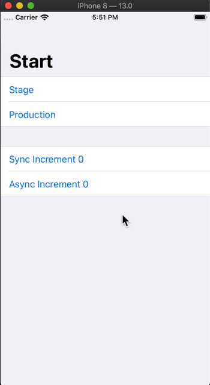

# Cycler

*This readme is working in progress*

## What is Cycler?

This is one of the ideas for ViewModel layer.

Mainly it's inspired by Flux architecture.


## CyclerType

CyclerType just defines clean data-flow.

So, We are free that how we use Cycler.

One of the usages, CyclerType adapts ViewModel of MVVM architecture.

### It has State that is observable

### It updates State by receiving Mutation or Action

Receive **Mutation** as **Commit**

Receive **Action** as **Dispatch**

### It emits Activity by receiving Mutation or Action

Sometimes, There are some events that don't need store to State by Action or Mutation.
So, We call them `Activity`.

**Protocol**

```swift
public protocol CyclerType {
  associatedtype State
  associatedtype Activity
  var state: Storage<State> { get }
}
```

**Extension-Methods**

```swift
extension CyclerType {
  
  public var activity: Signal<Activity>
  
  public func commit(
      _ name: String = "",
      _ description: String = "",
      file: StaticString = #file,
      function: StaticString = #function,
      line: UInt = #line,
      _ mutate: @escaping (MutableStorage<State>) throws -> Void
      ) rethrows

  public func dispatch<T>(
    _ name: String = "",
    _ description: String = "",
    file: StaticString = #file,
    function: StaticString = #function,
    line: UInt = #line,
    _ action: (CyclerWeakContext<Self>) throws -> T
    ) rethrows -> T
    
  public func emit(
    _ activity: Activity,
    file: StaticString = #file,
    function: StaticString = #function,
    line: UInt = #line
    )
}
```

## Storage

This is Storage that used for current **State**.

```swift
public class Storage<T> {
  public var value: T { get }
  public func add(subscriber: @escaping (T) -> Void) -> Token
  public func remove(subscriber: Token)
}

public final class MutableStorage<T> : Storage<T> {
  public func replace(_ value: T)
  public func batchUpdate(_ update: (MutableStorage<T>) -> Void)
  public func update<E>(_ value: E, _ keyPath: WritableKeyPath<T, E>)
  public func updateIfChanged<E>(_ value: E, _ keyPath: WritableKeyPath<T, E>, comparer: (E, E) -> Bool)
  public func asStorage() -> Storage<T>
}
```

### It updates value by KeyPath

```swift
let state: MutableStorage<State>
state.update("some-value", \State.content.name)
```

**Why?**

We can know what is updated by updating by KeyPath.

That will be helpful for logging.

### It can use without RxSwift

We can use `Storage` as standalone.

## Logging

We can log event about Cycler.

- Logs are
  - Changes state
  - Receives mutations
  - Receives actions
  - Emits activities

```swift
public protocol MutableStorageLogging {

  func didChange(value: Any, for keyPath: AnyKeyPath, root: Any)
  func didReplace(root: Any)
}

public protocol CycleLogging : MutableStorageLogging {

  func didEmit(activity: Any, file: StaticString, function: StaticString, line: UInt, on cycler: AnyCyclerType)
  func willDispatch(name: String, description: String, file: StaticString, function: StaticString, line: UInt, on cycler: AnyCyclerType)
  func willMutate(name: String, description: String, file: StaticString, function: StaticString, line: UInt, on cycler: AnyCyclerType)
  func didMutate(name: String, description: String, file: StaticString, function: StaticString, line: UInt, on cycler: AnyCyclerType)
}
```

# Usage

## Actual Code

### Define ViewModel

```swift

import Cycler

class ViewModel : CyclerType {

  enum Activity {
    case didReachBigNumber
  }

  struct State {

    // - Data
    fileprivate var count: Int = 0
    
    // - Computed
    // It will be subscribed whole of this State, so, we can use computed property.
    var countText: String {
      return count.description
    }
  }

  private let disposeBag = DisposeBag()

  let state: Storage<State> = .init(.init(count: 0))

  init() {
  
  }

  func increment(number: Int) {

    // Dispatch Action
    // Action can contain async operation.
    dispatch("increment") { (context) in
      
      // Context references self weakly.
      
      Observable.just(())
        .delay(0.1, scheduler: MainScheduler.instance)
        .do(onNext: {

          // Retain references of context
          // So, run operation completely in this scope.
          context.retain { c in
            
            // Mutation
            // Transaction for mutating.
            c.commit { (state) in
              // State is MutableStorage.
              state.updateIfChanged(state.value.count + number, \.count)
            }
          
            if c.currentState.count > 10 {
              // Emit Activity.
              // Activity just an event that does not need to store to State.
              c.emit(.didReachBigNumber)
            }
          }
        })
        .subscribe()
      }
      .disposed(by: disposeBag)
  }

  func decrement(number: Int) {

    dispatch("decrement") { _ in
      commit { (state) in
        state.updateIfChanged(state.value.count - number, \.count)
      }
    }

  }
}

```

### Subscribe State

```swift
let viewModel = ViewModel()

// Subscribe one property of the State.

viewModel
  .state
  .asObservable()
  .map { $0.countText }
  .distinctUntilChanged()
    
// Or, subscribe one property of the State by KeyPath.
  
viewModel
  .state
  .asObservable(keyPath: \.countText)
  .distinctUntilChanged()
```

**distinctUntilChanged** is very important.

Mutation will mutate whole of the State.
Observable from the State will send event whenever updating the State.
This behavior will cause unnecessary operations.

### Subscribe Activity

```swift
  
// Subscribe activity.
viewModel
  .activity
  .emit(...)
  
```

# Basically Demo


