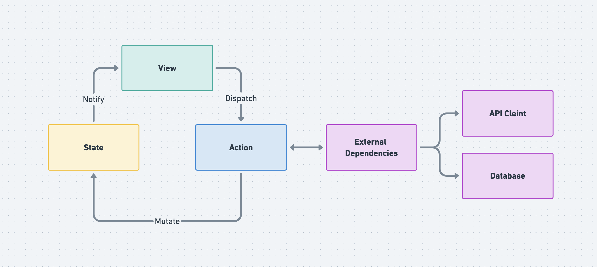

# Verge - Neue (SwiftUI / UIKit)

> ⚠️ Currently in progress

Latest released Verge => [`master` branch](https://github.com/muukii/Verge/tree/master)

**Verge - Neue** is an unidirectional-data-flow framework.



## Architecture

The sources are in `VergeNeue` directory.

**Demo Application** is in `VergeNeueDemo` directory.<br>
Demo implementations are super experimentally code. I think there are no best practices. So these may be updated. 

* Store / ScopedStore
* Reducer
  * Mutation
  * Action
  
**Creating Store**
  
```swift
let rootStore = Store(
  state: RootState(),
  reducer: RootReducer()
)
```

**State**

```swift
struct RootState {
     
  var count: Int = 0
  
}
```

**Reducer**

We can choose class or struct depends on use cases.

Store uses Reducer as an instance.<br>
This means Reducer can have some dependencies. (e.g Database, API client)

```swift
class RootReducer: ReducerType {
  
  typealias TargetState = RootState

  func syncIncrement() -> Mutation {
    return .init {
      $0.count += 1
    }
  }
  
  func asyncIncrement() -> Action<Void> {
    return .init { context in
      DispatchQueue.main.asyncAfter(deadline: .now() + 1) {
        context.commit { $0.syncIncrement() }
      }
    }
  }
}
```

**Commit Mutation**

```swift
store.commit { $0.syncIncrement() }
```

**Dispatch Action**

```swift
store.dispatch { $0.asyncIncrement() }
```

**ScopedStore**

`ScopedStore` is a node object detached from `Store`<br>
It initializes with `Store` as parent store and WritableKeyPath to take fragment of parent store's state.

Its side-effects dispatch and commit affects parent-store.<br>
And receives parent-store's side-effects 

