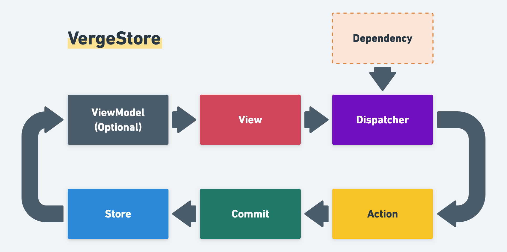

# Verge - Store (SwiftUI / UIKit) (Planning v6.0.0)

Latest released Verge => [`master` branch](https://github.com/muukii/Verge/tree/master)



## Concept

The concept of VergeStore is inspired by [Redux](https://redux.js.org/) and [Vuex](https://vuex.vuejs.org/).

The characteristics are

- Creating one or more Dispatcher. (Single store, multiple dispatcher)
- A dispatcher can have dependencies service needs. (e.g. API Client, DB)
- No switch-case to reduce state
- Support Logging (Commit, Action, Performance monitoring)

### 🪐 Store

- Store holds application state.
- Allows access to `Store.state`
- Allows state to be updated via `Dispatcher.commit()`

```swift
struct State {

  struct Todo {
    var title: String
    var hasCompleted: Bool
  }

  var todos: [Todo] = []

}

class MyStore: VergeDefaultStore<State> {

  init() {
    super.init(initialState: .init(), logger: nil)
  }
}

let store = MyStore()
```

### 🚀 Dispatcher

Mainly, Dispatcher allows Store.state to be updated.

To change state, use **Mutation** via `commit()`.<br>
To run asynchronous operation, use **Action** via `dispatch()`.

```swift
class MyDispatcher: Dispatcher<RootState> {

}

let store = MyStore()
let dispatcher = MyDispatcher(target: store)
```

`MyStore` provies typealias to `Dispatcher<RootState>` as `MyStore.DispatcherType`.

### ☄️ Mutation

The only way to actually change state in a Verge store is by committing a mutation.
Define a function that returns Mutation object. That expresses that function is Mutation

Mutation object is simple struct that has a closure what passes current state to change it.

> Mutation does not run asynchronous operation.

```swift
class MyDispatcher: Dispatcher<RootState> {
  func addNewTodo(title: String) {
    commit { (state: inout RootState) in
      state.todos.append(Todo(title: title, hasCompleted: false))
    }
  }
}

let store = MyStore()
let dispatcher = MyDispatcher(target: store)

dispatcher.addNewTodo(title: "Create SwiftUI App")

print(store.state.todos)
// store.state.todos => [Todo(title: "Create SwiftUI App", hasCompleted: false)]
```

### 🌟 Action

Action is similar to Mutation.
Action can contain arbitrary asynchronous operations.

To run Action, use `dispatch()`.

To commit Mutations inside Action, Use context.commit.

```swift
class MyDispatcher: Dispatcher<RootState> {

  @discardableResult
  func fetchRemoteTodos() -> Future<Void> {
    dispatch { context in

      return Future<[Todo], Never> { ... }
        .sink { todos in

          context.commit { state in
            state.todos = todos
          }

       }
       ...
    }
  }

}

let store = MyStore()
let dispatcher = MyDispatcher(target: store)

dispatcher.fetchRemoteTodos()

// After Future completed

print(store.state.todos)
// [...]
```

Actions are often asynchronous, So we may need to know the timing action completed inside the view.<br>
`dispatch()` allows returning anything. For example, we can return Future object to caller.<br>
It can allow composite actions.

## Advanced

### ScopedDispatching

To handle nested states efficiently.

VergeStore provides the `ScopedDispatching` protocol to expand Dispatcher's function.

```swift
public protocol ScopedDispatching: Dispatching {
  associatedtype Scoped

  var selector: WritableKeyPath<State, Scoped> { get }
}
```

Explanation with following state example.

```swift
struct State: StateType {

  struct NestedState {

    var myName: String = ""
  }

  var optionalNested: NestedState?
  var nested: NestedState = .init()
}
```

Create Dispatcher that has `ScopedDispatching`

```swift
final class OptionalNestedDispatcher: Store.DispatcherType, ScopedDispatching {

  var selector: WritableKeyPath<State, State.NestedState?> {
    \.optionalNested
  }

  func setMyName() {
    commitIfPresent {
      $0.myName = "Hello"
    }
  }

}
```

`ScopedDispatching` works with a slice of the state.

`ScopedDispatching.Scoped` points where is a slice on the state.

`ScopedDispatching` requires `selector` to get a slice of the state.

If `Scoped` is optional type, can use `commitScopedIfPresent()`.<br>
It runs only when the selected slice is existing.

If it's not, can use `commitScoped()`

## References

## Normalized State Shape

[https://redux.js.org/recipes/structuring-reducers/normalizing-state-shape](https://redux.js.org/recipes/structuring-reducers/normalizing-state-shape)

## Installation

Currently it supports only CocoaPods.

In Podfile

```
pod 'VergeStore'
```

## Author

Hiroshi Kimura (Muukii) <muukii.app@gmail.com>
