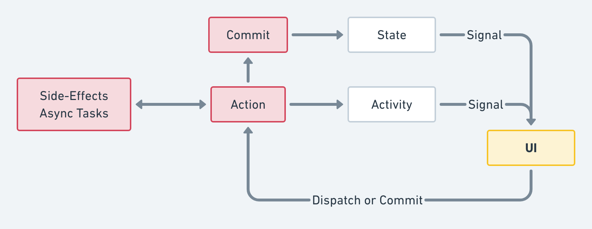

# Verge

*This readme is working in progress*

## What is Verge?

This is one of the ideas for ViewModel layer.

Mainly it's inspired by Flux architecture.



https://whimsical.co/6vgPs6dsjsatAMyZ6oHDsq

## VergeType

VergeType just defines clean data-flow.

So, We are free that how we use Verge.

One of the usages, VergeType adapts ViewModel of MVVM architecture.

### It has State that is observable

### It updates State by receiving Mutation or Action

Receive **Mutation** as **Commit**

Receive **Action** as **Dispatch**

### It emits Activity by receiving Mutation or Action

Sometimes, There are some events that don't need store to State by Action or Mutation.
So, We call them `Activity`.

**Protocol**

```swift
public protocol VergeType {
  associatedtype State
  associatedtype Activity
  var state: Storage<State> { get }
}
```

**Extension-Methods**

```swift
extension VergeType {

  public var activity: Signal<Activity>

  public func commit(
    _ name: String = "",
    _ description: String = "",
    _ file: StaticString = #file,
    _ function: StaticString = #function,
    _ line: UInt = #line,
    _ mutate: (inout State) throws -> Void
    ) rethrows

  public func dispatch<T>(
    _ name: String = "",
    _ description: String = "",
    file: StaticString = #file,
    function: StaticString = #function,
    line: UInt = #line,
    _ action: (DispatchContext<Self>) throws -> T
    ) rethrows -> T
}
```

## Storage

This is Storage that used for current **State**.

```swift
public class Storage<T> {
  public var value: T { get }
  public convenience init(_ value: T)
  public init(_ source: MutableStorage<T>)
  public func add(subscriber: @escaping (T) -> Void) -> StorageSubscribeToken
  public func remove(subscriber token: StorageSubscribeToken)
}

public final class MutableStorage<T> {
  public var loggers: [MutableStorageLogging]
  public var value: T { get }
  public init(_ value: T)
  public func add(subscriber: @escaping (T) -> Void) -> StorageSubscribeToken
  public func remove(subscriber: StorageSubscribeToken)
  public func update(_ update: (inout T) throws -> Void) rethrows
  public func replace(_ value: T)
  public func asStorage() -> Storage<T>
}
```

### It can use without RxSwift

We can use `Storage` as standalone.

## Logging

We can log event about Actions and Commits in Verge.

- Logs are
  - Changes state
  - Receives mutations
  - Receives actions
  - Emits activities

Use `VergeLogging`

## `distinctUntilChanged` is very important.

Mutation will mutate whole of the State.
Observable from the State will send event whenever updating the State.
This behavior will cause unnecessary operations.

# Basically Demo


