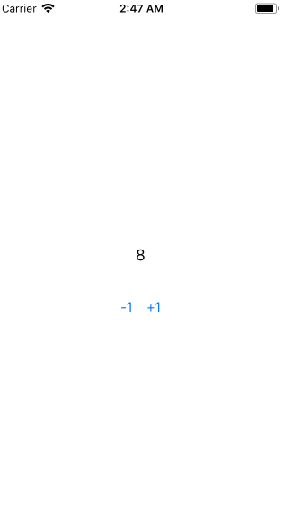

# Verge - Classic (Obsoluted)

## What is Verge?

This library is one of the ideas for ViewModel layer.
Built with the concept of Flux(Redux) architecture.
The main purpose of Flux is state management on the one place(like Store).
And clarify the mutations in the state. (Unidirectional Flow)
With this, we can observe how the state will be changed.

Almost implementation of Flux library has a way of mutations as `Payload`.
This is to describe that mutation.

But, Verge does not have that way.
We can define the mutation to mutation closure directly.

Verge just focuses only on management the state on the one place.


https://whimsical.co/6vgPs6dsjsatAMyZ6oHDsq

## Concept

### Container (like ViewModel, Store)

Firstly, we recommend creating a Container for each Screen(ViewController).
Container naming is anything. It's better to name ViewModel or Store or something.

Container must have `VergeType` protocol.

```swift
public protocol VergeType {
  associatedtype State
  associatedtype Activity
  var state: Storage<State> { get }
}
```

`VergeType` defines structure.

#### State

The container that has `VergeType` contains the `State`.

To create Container object has VergeType, It's like followings.

```swift
class ViewModel : VergeType {

  // Constrained Type by VergeType
  enum Activity {
  }

  // Constrained Type by VergeType
  struct State {
    fileprivate(set) var value: Int = 0
  }

  // Constrained Property by VergeType
  let state: Storage<State> = .init(.init())

  init() {

  }
}
```

#### Mutations

To run Mutation, use `commit` methodj that VergeType has.
`commit` allows to run synchronous tasks only.

```swift
extension ViewModel {

  func updateValue() {
    commit { s in
      s.value += 1
    }
  }

}
```

#### Actions

To run Action, use `dispatch` method that VergeType has.
`dispatch` allows to run asynchronous or synchronous tasks.

`dispatch` provides `context` as argument on closure.
`context` can call `commit`.

```swift
extension ViewModel {

  func updateValue() {
    dispatch { context in
      Single.just(())
        .delay(0.5, scheduler: MainScheduler.instance)
        .do(onSuccess: {

            context.commit { (state) in
              state.count += number
            }
        })
        .start() // this method is part of RxFuture.
    }
  }

}
```

#### Activity (a difference point)

The container that has `VergeType` contains the `Activity`.

Sometimes, There are some events that don't need store to State by Action or Mutation.
So, We call them `Activity`.

Use `emit` method context has.

```swift
extension ViewModel {

  func updateValue() {
    dispatch { context in
      Single.just(())
        .delay(0.5, scheduler: MainScheduler.instance)
        .do(onSuccess: {
          context.emit(.didReachBigNumber)
        })
        .start() // this method is part of RxFuture.
    }
  }

}
```

---

## Storage

This is Storage that used for current **State**.

```swift
public class Storage<T> {
  public var value: T { get }
  public convenience init(_ value: T)
  public init(_ source: MutableStorage<T>)
  public func add(subscriber: @escaping (T) -> Void) -> StorageSubscribeToken
  public func remove(subscriber token: StorageSubscribeToken)
}

public final class MutableStorage<T> {
  public var loggers: [MutableStorageLogging]
  public var value: T { get }
  public init(_ value: T)
  public func add(subscriber: @escaping (T) -> Void) -> StorageSubscribeToken
  public func remove(subscriber: StorageSubscribeToken)
  public func update(_ update: (inout T) throws -> Void) rethrows
  public func replace(_ value: T)
  public func asStorage() -> Storage<T>
}
```

### It can use without RxSwift

We can use `Storage` as standalone.

## Logging

We can log event about Actions and Commits in Verge.

- Logs are
  - Changes state
  - Receives mutations
  - Receives actions
  - Emits activities

Use `VergeLogging`

## `distinctUntilChanged` is very important.

Mutation will mutate whole of the State.
Observable from the State will send event whenever updating the State.
This behavior will cause unnecessary operations.

# Basically Demo

This demo is super far away from real world.
In real world applications, it will be more complicated.



# Authors

- muukii <muukii.app@gmail.com>
