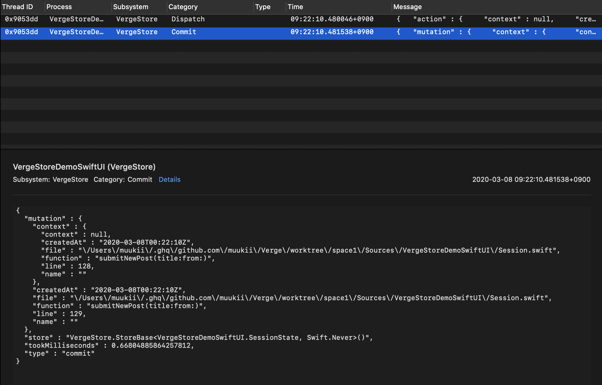

# 🔭 Logging - Take logs performed Mutation and Action

## Logging


Sorry, this documentation is currently working in progress.


## Use DefaultStoreLogger

DefaultStoreLogger is the pre-implemented logger.

To enable logging, set the logger instance to StoreBase's initializer.

```swift
StoreBase<MyState, MyActivity>.init(
  initialState: ...,
  logger: DefaultStoreLogger.shared // 🤩
)
```

We can see the log like below

### Action

```text
2020-02-19 01:59:22.742925+0900 VergeStoreDemoSwiftUI[22041:3169794] [Dispatch] {
  "action" : {
    "context" : null,
    "createdAt" : "2020-02-18T16:59:22Z",
    "file" : "\/Users\/muukii\/.ghq\/github.com\/muukii\/Verge\/worktree\/space1\/Sources\/VergeStoreDemoSwiftUI\/Session.swift",
    "function" : "submitNewPost(title:from:)",
    "line" : 128,
    "name" : ""
  },
  "store" : "StoreBase<SessionState, Never>()",
  "type" : "dispatch"
}
```

### Commit

```text
2020-02-19 01:59:22.744111+0900 VergeStoreDemoSwiftUI[22041:3169794] [Commit] {
  "mutation" : {
    "context" : {
      "context" : null,
      "createdAt" : "2020-02-18T16:59:22Z",
      "file" : "\/Users\/muukii\/.ghq\/github.com\/muukii\/Verge\/worktree\/space1\/Sources\/VergeStoreDemoSwiftUI\/Session.swift",
      "function" : "submitNewPost(title:from:)",
      "line" : 128,
      "name" : ""
    },
    "createdAt" : "2020-02-18T16:59:22Z",
    "file" : "\/Users\/muukii\/.ghq\/github.com\/muukii\/Verge\/worktree\/space1\/Sources\/VergeStoreDemoSwiftUI\/Session.swift",
    "function" : "submitNewPost(title:from:)",
    "line" : 129,
    "name" : ""
  },
  "store" : "StoreBase<SessionState, Never>()",
  "took" : "0.9820461273193359ms",
  "type" : "commit"
}
```

### See logs on Console.app



## Creating Custom Logger

```swift
public protocol StoreLogger {
  
  func willCommit(store: AnyObject, state: Any, mutation: MutationMetadata)
  func didCommit(store: AnyObject, state: Any, mutation: MutationMetadata, time: CFTimeInterval)
  func didDispatch(store: AnyObject, state: Any, action: ActionMetadata)
  
  func didCreateDispatcher(store: AnyObject, dispatcher: Any)
  func didDestroyDispatcher(store: AnyObject, dispatcher: Any)
}
```

